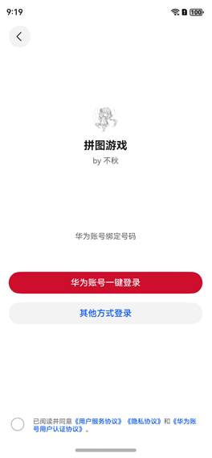
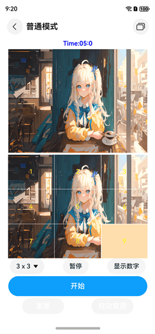
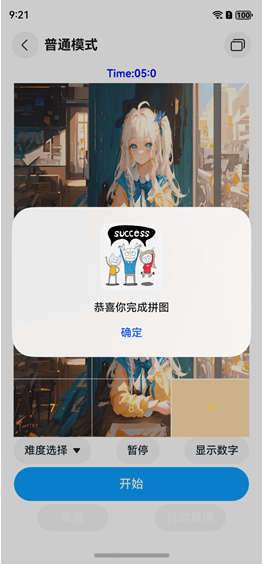
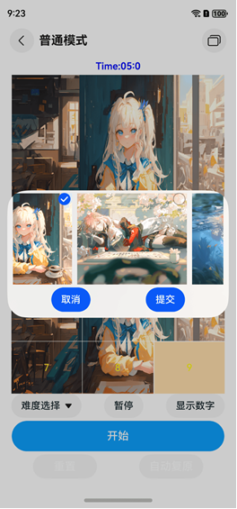
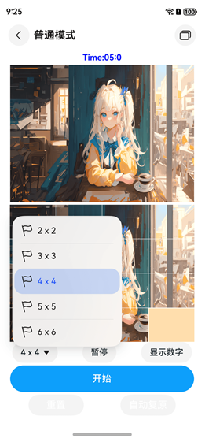
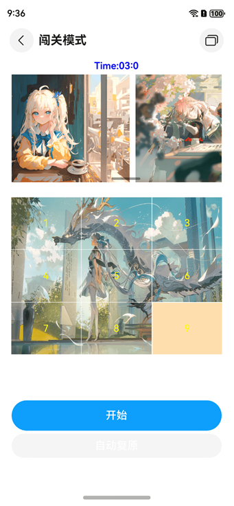

# 拼图

### 介绍
本项目为学习鸿蒙开发Arkts时所写

该示例通过@ohos.multimedia.image和@ohos.file.photoAccessHelper接口实现获取图片，以及图片裁剪分割的功能。

### 创新点和特色
>实现拼图的自动还原功能，并实现可视化还原过程,实现算法的步骤实时动画演示

**使用A*算法+自定义PriorityQueue实现辅助还原功能**

本拼图游戏中实现了一个“辅助还原”功能，允许玩家在卡关时点击按钮，让系统自动还原拼图。该功能的核心是A*算法和自定义优先队列（PriorityQueue）的结合，实现智能化的路径规划。
A*算法简介
A算法是一种启发式搜索算法，广泛用于路径规划和最短路径求解。A算法通过以下公式计算每个节点的优先级： f(n)=g(n)+h(n)f(n) = g(n) + h(n)f(n)=g(n)+h(n)
•	g(n) 表示从起点到当前节点的代价（移动步数）。
•	h(n) 是启发式函数，用于估算从当前节点到目标节点的代价。在拼图还原中，通常选择曼哈顿距离或不在位块的数量作为启发式函数。
实现步骤：
1.	定义目标状态：目标状态是拼图的完成状态，即图片的完整图像。
2.	定义启发式函数：启发式函数 h(n) 计算每个拼图块与其目标位置之间的距离。通常使用曼哈顿距离，即每个拼图块到目标位置的水平和垂直移动步数之和。
3.	使用自定义 PriorityQueue：优先队列用于管理A*算法的节点，每次优先处理优先级最低的节点。自定义的PriorityQueue可以根据 f(n) 值动态排序队列中的节点，从而实现智能路径规划。
4.	搜索路径：
      -	从当前拼图状态出发，使用A*算法进行搜索，将每一个可能的移动状态放入PriorityQueue中，并计算其 f(n) 值。
      -	每次从优先队列中取出优先级最高（f(n) 值最低）的状态，检查是否为目标状态。
      -	如果达到了目标状态，则返回还原路径。
      -	如果未达到目标状态，则将该状态的所有可能移动继续放入优先队列，并继续搜索。
5.	还原过程可视化：
      -	在找到还原路径后，将路径中的每一步逐步呈现给玩家，实现拼图的逐步还原。这一过程通过动画实现，让玩家能够观看每一步的移动，直观了解还原过程。
      优点：
      -	智能化：A*算法结合自定义PriorityQueue实现高效的路径搜索，能够快速找到最优的还原路径。
      -	用户友好：通过可视化显示还原过程，玩家能够清晰地看到拼图的复原步骤，不仅解决了卡关的问题，还帮助玩家理解拼图逻辑。
      -	高效性能：A*算法的启发式设计使得搜索过程较为高效，配合自定义优先队列确保了算法的执行效率，适合在移动设备上运行。

### 效果预览
| 首页                                        | 登录                                       |
|-------------------------------------------|------------------------------------------|
|  |  |

| 普通模式                           | 游戏成功弹窗                          |
|--------------------------------|---------------------------------|
|  | |

| 图片选择                    | 图库选择                |
|-------------------------|---------------------|
|  |  |

| 难度选择                   | 关卡选择                    |
|------------------------|-------------------------|
| |  |

| 闯关模式                    |
|-------------------------|
|  |


### 使用说明：
1. 使用预置相机拍照后启动应用，应用首页会读取设备内的图片文件并展示获取到的第一个图片，没有图片时图片位置显示空白；
2. 点击开始按钮开始后，时间开始倒计时，在规定时间内未完成拼图则游戏结束。在游戏中，玩家点击重新开始进行游戏重置；
3. 点击开始游戏后，玩家可以根据上方的大图，点击黄格周围的图片移动，点击后图片和黄格交换位置,最终拼成完整的图片；
4. 不在游戏中时，玩家可以点击上方大图，选择自定义图片来进行拼图游戏。

### 工程目录
```
📂 ets
│── 📂 application
│   │── CommonConstants.ets    # 公共常量定义
│   │── ImagePicker.ets        # 图片选择器功能
│
│── 📂 entryability            # 入口能力模块
│
│── 📂 model                   # 数据模型
│   │── GameRules.ets          # 游戏规则
│   │── ImageModel.ets         # 图片数据模型
│   │── Logger.ets             # 日志记录功能
│   │── PictureItem.ets        # 图片项数据
│   │── PriorityQueue.ets      # 优先队列实现
│   │── PuzzleSolver.ets       # A*算法拼图求解
│
│── 📂 pages                   # 页面模块
│   │── Game1.ets              # 游戏页面 1
│   │── Game2.ets              # 游戏页面 2
│   │── Indexes.ets            # 索引页面
│   │── Level.ets              # 关卡页面
│   │── Login.ets              # 登录页面
│   │── Test.ets               # 测试页面
│
│── 📂 View                    # 视图组件
│   │── ButtonComponent.ets    # 按钮组件
│   │── ImageGridComponent.ets # 图片网格组件
│   │── ImageSelectComponent.ets # 图片选择组件
│   │── SelectComponent.ets    # 选择组件
│   │── TimerComponent.ets     # 计时器组件
│
│── 📂 viewModel               # 视图数据模型
│   │── GameData.ets           # 游戏数据管理
│   │── NavigationData.ets     # 导航数据
│   │── PageParam.ets          # 页面参数
│
│── 📂 resources               # 资源文件
│   ├── 📂 base
│   │   ├── 📂 element
│   │   ├── 📂 media           # 媒体资源（图片、SVG等）
│   │   │   ├── background_1.jpg
│   │   │   ├── bookmark.svg
│   │   │   ├── flag.svg
│   │   │   ├── icon.jpg
│   │   │   ├── magnifyingglass.svg
│   │   │   ├── person.svg
│   │   │   ├── pin.svg
│   │   │   ├── rectangle_on_rectangle.svg
│   │   │   ├── share.svg
│   │   │   ├── star.svg
│   │   │   ├── success_6032148_1280.jpg
│   ├── main_pages.json        # 主要页面数据
│   ├── route_map.json         # 路由映射

```
### 具体实现
+ 游戏中图片裁剪分割的效果实现在ImageModel中，源码参考[ImageModel](entry/src/main/ets/model/ImageModel.ets):
  + 获取本地图片：首先使用getPhotoAccessHelper获取相册管理模块实例，然后使用getAssets方法获取文件资源，最后使用getAllObjects获取检索结果中的所有文件资产方便展示；
  + 裁剪图片准备：裁剪图片需要使用@ohos.multimedia.image接口，裁剪前需要申请图片编辑权限，使用requestPermissionsFromUser申请，源码参考[Index.ets](entry/src/main/ets/pages/test.ets);
  + 图片编辑：首先使用createImagePacker创建ImagePacker实例，然后使用fs.open打开文件，调用createImageSource接口创建图片源实例方便操作图片，接下来使用getImageInfo方法获取图片大小便于分割，最后使用createPixelMap方法传入每一份的尺寸参数完成图片裁剪。

### 相关权限

读取图片及视频权限：ohos.permission.READ_IMAGEVIDEO

### 依赖

不涉及。

### 约束与限制

1.本示例仅支持标准系统上运行，支持设备：华为手机。

2.HarmonyOS系统：HarmonyOS NEXT Developer Beta1及以上。

3.DevEco Studio版本：DevEco Studio NEXT Developer Beta1及以上。

4.HarmonyOS SDK版本：HarmonyOS NEXT Developer Beta1 SDK12及以上。