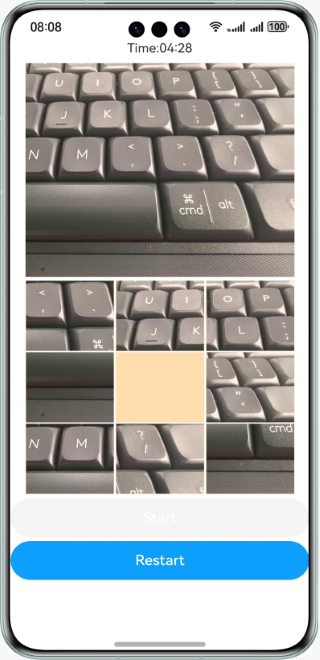

# Puzzle Game

### Overview

This sample uses the **@ohos.multimedia.image** and **@ohos.file.photoAccessHelper** APIs to obtain and crop an image.

### Preview
| Home page                                    | Operation                                   |
|----------------------------------------------|---------------------------------------------|
|  |  |

### How to Use
1. 1. The sample app reads the image files on the local device and displays the first image it obtains. If there is no image on the local device, a blank is displayed.
2. Touch **Start**, and the countdown begins. If you fail to finish the puzzle within the specified time, the game ends. During the game, the player taps the restart button to reset the game.
3. When the game is in progress, you can touch any image around the yellow grid to swap the position of the image and highlighted grid cell, until you get a complete image.
4. When the game is not in progress, you can touch the large image on the top and select another image for the game.

### Project Directory
```
├──entry/src/main/ets                         // Code area
│  ├──application
│  │  └──AbilityStage.ets
│  ├──common
│  │  ├──CommonConstants.ets                  // Constant class
│  │  └──ImagePicker.ets                      // Image selection
│  ├──entryability
│  │  └──EntryAbility.ets 
│  ├──model
│  │  ├──GameRules.ets                        // Game rules
│  │  ├──ImageModel.ets                       // Image operation
│  │  ├──Logger.ets                           // Logger
│  │  └──PictureItem.ets                      // Segmented image items
│  └──pages
│     └──Index.ets                            // Home page
└──entry/src/main/resources                   // App resource directory
```
### How to Implement
+ The image cropping and segmentation effect is implemented in ImageModel. For details about the source code, see [ImageModel](entry/src/main/ets/model/ImageModel.ets).
  + Obtain local images: Call the **getPhotoAccessHelper** method to obtain the album management module instance, call the **getAssets** method to obtain file resources, and call the **getAllObjects** method to obtain all file assets in the search result for display.
  + Prepare for image cropping. To crop an image, call the **@ohos.multimedia.image** API. Before cropping, you need to apply for the image editing permission by calling **requestPermissionsFromUser**. For details about the source code, see [Index.ets](entry/src/main/ets/pages/test.ets);
  + Edit an image: Call **createImagePacker** to create an ImagePacker instance, open the image file using fs.open, and call **createImageSource** to create an image source instance to facilitate image operations. Then call **getImageInfo** to obtain the image size for segmentation. Finally, call the **createPixelMap** method to pass the size parameters of each image to complete image cropping.

### Required Permissions

Permission to read images and videos: ohos.permission.READ_IMAGEVIDEO

Permission to modify images or videos: ohos.permission.WRITE_IMAGEVIDEO

### Dependencies

N/A

### Constraints

1. The sample app is supported only on Huawei phones running the standard system.

2. The HarmonyOS version must be HarmonyOS NEXT Developer Beta1 or later.

3. The DevEco Studio version must be DevEco Studio NEXT Developer Beta1 or later.

4. The HarmonyOS SDK version must be HarmonyOS NEXT Developer Beta1 or later.
